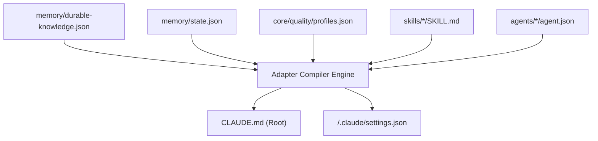

# Claude Code Translation Rules (`CLAUDE.md`)

## 1. Overview & Architectural Role
Anthropic Claude Code reads a single root markdown file (`CLAUDE.md`) at the beginning of each interactive session. In addition, user-level standing instructions can exist at `~/.claude/CLAUDE.md`.
The Project Intelligence framework translates canonical universal instructions, active lifecycle state, quality profile constraints, and available skill pointers into a deterministic, high-signal `CLAUDE.md`.

---

## 2. Compilation Pipeline

The translation engine assembles `CLAUDE.md` from the following canonical sources:
1. **Header & Context**: `memory/durable-knowledge.json` -> Project charter, mission, and tech stack.
2. **Anti-Slop Guardrails**: `core/quality/profiles.json` -> Mandatory Baseline Profile rules.
3. **Active Lifecycle State**: `memory/state.json` -> Current gate (G0–G6), active phase, and locked contracts.
4. **Tool Restrictions & Safety**: `agents/orchestrator/agent.json` -> Tool permission manifests and safe bash command boundaries.
5. **Skill Index**: `skills/*/SKILL.md` -> Available skills and natural language activation triggers.
6. **Subagent Delegation Architecture**: `agents/` -> Handoff procedures and file boundary rules.

---

## 3. Section-by-Section Translation Rules

### Section A: Project Identity & Charter
- **Rule**: Extract `projectName`, `missionStatement`, and `constraints` from `contracts/project/contract.json` or `memory/durable-knowledge.json`.
- **Constraint**: Must remain under 150 words to minimize token overhead.

### Section B: Universal Anti-Slop Directive
- **Rule**: Injected verbatim into every generated `CLAUDE.md`:
  > "Do not use decorative non-functional emojis. Do not insert stub functions, empty exception handlers, or mock data in production paths. Do not expand scope without explicit human authorization. All claims of completion require verifiable test, lint, or build evidence."

### Section C: Active Lifecycle Gate & Contract Binding
- **Rule**: Dynamically read `currentGate` from `memory/state.json`.
- **Content**:
  - State the active gate (e.g., `ACTIVE GATE: G4 (Implementation Verification)`).
  - Explicitly list the target contract path (`contracts/implementation/contract.json`).
  - Declare that progression to the next gate requires satisfying exit criteria in `core/lifecycle/lifecycle-fsm.json`.

### Section D: Tool Execution & Sandbox Guardrails
- **Rule**: Map `toolPermissions` of the active agent/role.
- **Allowed Command Prefixes**: Generate strict lists for bash command usage (e.g., `pytest`, `python -m unittest`, `git status`).
- **File Mutation Boundary**: If an active task is bound to specific files, declare them under `ALLOWED MUTABLE PATHS`.

### Section E: Skills Directory Integration
- **Rule**: Claude Code natively supports `SKILL.md` files located in project directories. The adapter maps all 12 canonical skills in `skills/` and provides a summary table in `CLAUDE.md` listing each skill and its trigger phrases.

### Section F: Subagent Delegation Protocol
- **Rule**: Claude Code supports isolated subagent execution. In `CLAUDE.md`, describe how the Lead Orchestrator delegates tasks to subagents:
  - Subagents execute with isolated context.
  - Subagents must write evidence back to designated files.
  - Subagents must strictly respect bounded directories.

---

## 4. Token & Size Budget
- `CLAUDE.md` must not exceed **2,500 tokens** (approx. 10 KB). Excessive standing instructions degrade model attention. Detailed behavioral guidelines are delegated to on-demand skills.
