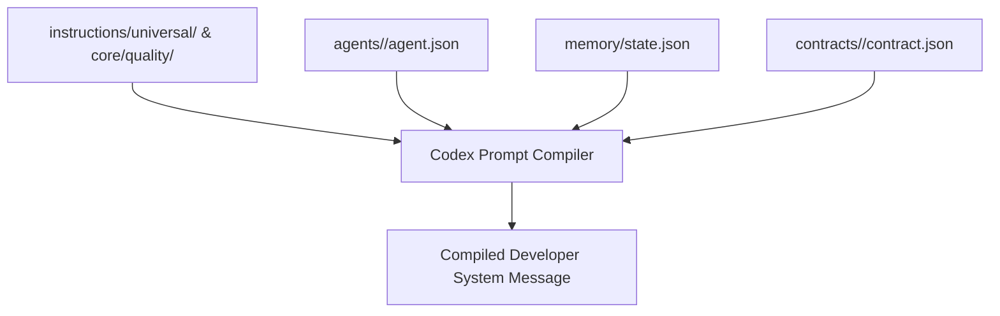

# OpenAI Codex System Prompt Compilation Rules

## 1. Overview & Architectural Role
In OpenAI Codex and the OpenAI Agents SDK, instructions are supplied directly as developer system messages (commonly termed the "Constitution" or "System Prompt"). Unlike tools that scan root markdown files, Codex execution models rely on programmatic initialization or environment compilation.

The Codex adapter compiles the canonical instructions, active gate contracts, and role definitions into an optimized, unambiguous system prompt that enforces strict schema validation and tool safety.

---

## 2. Compilation Flow

---

## 3. Compilation Sections & Assembly Rules

### Section 1: Agent Role & Mission Statement
- Injects the `roleName` and `mission` from the active agent's `agent.json`.
- Establishes the agent's identity and boundaries.

### Section 2: Universal Engineering Constitution
- Embeds the core anti-slop rules from `core/quality/profiles.json`:
  1. No decorative non-functional emojis.
  2. No stubs, empty function bodies, or fake mock data in production.
  3. No unapproved scope expansion.
  4. All assertions of completion require execution evidence.

### Section 3: Active Lifecycle Gate Context
- Embeds `currentGate` from `memory/state.json` (e.g. `G4: Implementation Verification`).
- Injects the path to the required contract (`contracts/implementation/contract.json`).
- Injects gate entry and exit criteria from `core/lifecycle/lifecycle-fsm.json`.

### Section 4: Tool Calling Guardrails & Schema Enforcement
- Maps the agent's `toolPermissions` into OpenAI Function Calling JSON Schema definitions with `"strict": true`.
- Injects parameter validation rules prohibiting dangerous shell flags or unassigned file paths.

### Section 5: Programmatic Handoff Protocol
- Injects instructions on how to invoke handoffs using the Agents SDK `Handoff(target=...)` function tools.

---

## 4. Token Budget & Context Window Optimization
- Total compiled system prompt must not exceed **3,000 tokens**.
- For model context efficiency, contract data payloads are referenced via file paths rather than inlined entirely into the system prompt.
