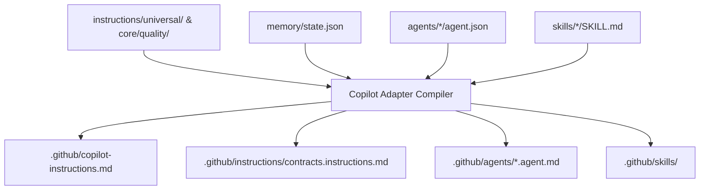

# GitHub Copilot Translation Rules

## 1. Overview & Architectural Role
GitHub Copilot supports workspace-level standing instructions via `.github/copilot-instructions.md`, path-specific rules via `.github/instructions/**/*.instructions.md`, and custom agent personalities via `.github/agents/*.agent.md`.
Because Copilot lacks native pre-tool hooks, instruction generation must emphasize clear guardrails, strict anti-slop rules, and prompt-driven contract enforcement.

---

## 2. Compilation Architecture

The GitHub Copilot adapter maps the canonical Project Intelligence repository into GitHub's conventions:



---

## 3. Translation Mapping Rules

### Rule 1: Root Instructions (`.github/copilot-instructions.md`)
- **Source**: `memory/durable-knowledge.json`, `memory/state.json`, and Mandatory Baseline Profile from `core/quality/profiles.json`.
- **Structure**:
  1. **Workspace Persona & Core Law**: Defines the agent as a contract-governed AI engineer.
  2. **Active Gate State**: Embeds the current lifecycle gate (G0–G6) and required contract.
  3. **Anti-Slop Directives**: Explicitly forbids emojis, stubbed functions, mock returns in production, and unapproved scope expansion.
  4. **Custom Agent Invocation**: Explains how to invoke the 9 specialized agents using `@agent-name` syntax in chat.
  5. **Verification Mandate**: Injects instructions requiring test evidence before marking tasks complete.

### Rule 2: Path-Specific Instructions (`.github/instructions/`)
- **`contracts.instructions.md`**: Applied when editing files in `contracts/` or `core/schemas/`. Injects JSON Schema validation rules and forbids manual edits to locked contracts.
- **`src.instructions.md`**: Applied when editing application code. Enforces file ownership boundaries and prevents editing files outside the active task's assigned scope.

### Rule 3: Custom Agent Mapping (`.github/agents/*.agent.md`)
Each of the 9 canonical agents in `agents/` is translated into a `.github/agents/<roleId>.agent.md` file featuring:
- YAML Frontmatter:
  ```yaml
  ---
  name: <roleId>
  description: <mission>
  tools:
    - filesystem
    - terminal
  ---
  ```
- System Prompt: Converted from the canonical `systemPromptTemplate` with variables resolved or marked for runtime interpolation.

---

## 4. Size & Token Budget
GitHub Copilot injects `.github/copilot-instructions.md` into the context window of chat queries and inline completions. To prevent diluting reasoning capacity:
- `.github/copilot-instructions.md` is budgeted at **<= 2,000 tokens**.
- Detailed agent-specific prompts are housed in `.github/agents/*.agent.md` and only loaded when the user invokes that specific `@agent`.
