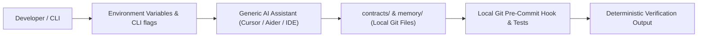

# Generic POSIX CLI & IDE Adapter Specification

## 1. Scope & Objective
This specification establishes the universal integration protocol for running the **Project Intelligence** framework across arbitrary development environments that lack native agent orchestration, such as:
- AI-augmented IDEs (Cursor, Windsurf, JetBrains AI Assistant, Cline)
- Terminal AI tools (Aider, Mentat, Shell-GPT)
- Editor plugins (Neovim Avante, Emacs gptel)
- Automated CI/CD pipelines and headless shell scripts

---

## 2. Core Architecture: The "Lowest Common Denominator" Principle

Because generic platforms do not guarantee native multi-agent handoffs, declarative hooks, or structured skill registries, this adapter establishes a **Single-Agent Sequential Execution Model** underpinned by local files and standard environment variables:

1. **File-Centric State**: All persistent memory, gate statuses, and contract data live in repository JSON files (`contracts/`, `memory/`).
2. **Environment Variable Configuration**: Runtime context is injected via standard environment variables:
   - `PROJECT_INTELLIGENCE_GATE`: Active gate (`G0` to `G6`).
   - `PROJECT_INTELLIGENCE_PROFILE`: Active quality profile (`baseline`, `cli_tool`, `web_service`, `security_sensitive`, `library`).
   - `PROJECT_INTELLIGENCE_ROLE`: Active role being assumed by the single agent.
3. **External Gate Enforcement**: Without client-side tool denial hooks, gate validation is enforced via Git `pre-commit` hooks and local test runners.

---

## 3. Protocol Specification

### 3.1 Single-Agent Sequential Emulation
When operating in a single-agent environment, the assistant dynamically adopts the role required by the active gate:

| Active Gate | Assumed Role | Target Contract | Allowed Actions |
|---|---|---|---|
| **G0** | Discovery Specialist | `contracts/project/contract.json` | Read-only inspection; draft G0 charter. |
| **G1** | Requirements Specialist | `contracts/requirements/contract.json` | Draft functional requirements & acceptance tests. |
| **G2** | Design Specialist | `contracts/design/contract.json` | Draft tokens/breakpoints or formal exemption record. |
| **G3** | Architecture Specialist | `contracts/architecture/contract.json` | System decomposition, interface contracts, ADRs. |
| **G4** | Implementation Specialist | `contracts/implementation/contract.json` | Bounded code edits within assigned files; local tests. |
| **G5** | Independent Reviewer | `contracts/quality/contract.json` | Adversarial audit of diffs, anti-slop check. |
| **G6** | Documentation Specialist | `contracts/release/contract.json` | Memory sync, changelog, release contract. |

### 3.2 Anti-Slop Directive Injection
In environments that support custom system prompts (Cursor `.cursorrules`, Aider `--message-file`, Windsurf `.windsurfrules`), the Universal Anti-Slop Directive is prepended:
> "MANDATORY QUALITY RULES: Never emit non-functional emojis. Never leave stubs, empty exception handlers, or mock data in production paths. Never expand scope beyond the active task. Progress requires verifiable test execution with exit code 0."
