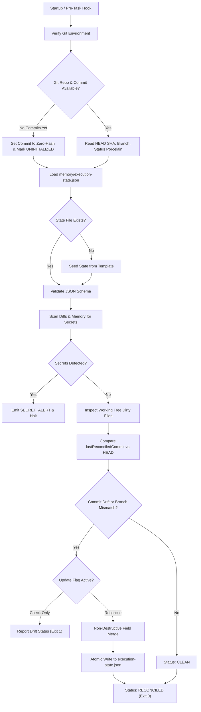

# Memory & State Reconciliation Rules Specification

**Document Version:** 1.0.0  
**Scope:** Workstream WS-07 (Git-Aware Memory & State Reconciliation Engine)  
**Conformance:** `core/schemas/memory.schema.json` & ADR-0001 / ADR-0002 / ADR-0003  

---

## 1. Architectural Foundation & The Three-Tier Memory Model

Project Intelligence maintains a local-first, git-centric project memory architecture. The framework does not rely on external databases, hosted SaaS stores, or hidden session caches. All state is explicit, auditable, and version-controlled.

Project memory is partitioned into three distinct tiers:

```
┌────────────────────────────────────────────────────────────────────────┐
│                        PROJECT MEMORY TOPOLOGY                         │
├────────────────────────────────────────────────────────────────────────┤
│  1. DURABLE KNOWLEDGE       • Project Charter & High-Level Objectives  │
│     (Long-Term)             • Architectural Decision Records (ADRs)    │
│                             • Coding Conventions & Style Standards     │
│                             • Authoritative Domain Vocabulary          │
├────────────────────────────────────────────────────────────────────────┤
│  2. EXECUTION STATE         • Active Lifecycle Gate (G0 to G6)         │
│     (Mid-Term / Ephemeral)  • Active Phase & Workstream Task Lists     │
│                             • Git Anchor Commit SHA & Branch Name      │
│                             • Working Tree Drift & Reconciliation Telemetry│
├────────────────────────────────────────────────────────────────────────┤
│  3. BACKLOG & HISTORY       • Defect Tracking Register (Bugs)          │
│     (Long-Term Accumulator) • Technical Debt Items & Rationale         │
│                             • Deferred Scope / Features                │
│                             • Chronological Decision Audit Trail       │
└────────────────────────────────────────────────────────────────────────┘
```

The **Reconciliation Engine** (`reconciler.py`) acts as the state synchronization authority between this three-tier memory and the physical git repository.

---

## 2. Detecting Stale Memory

Memory staleness occurs when an AI agent or human operates on assumptions derived from an outdated git baseline. Stale memory can lead to silent regressions, overwriting concurrent commits, duplicate task execution, and gate desynchronization.

### 2.1 The Staleness Detection Algorithm

At session initialization or before executing any workstream task, the reconciler evaluates the following checks:

1. **Commit SHA Verification:**
   - Query current git commit: `git rev-parse HEAD`.
   - Compare with `executionState.lastReconciledCommit`.
   - If `lastReconciledCommit == HEAD`, state is commit-synchronized.
   - If `lastReconciledCommit != HEAD`, commit drift exists.

2. **Commit Ancestry & Distance:**
   - Determine if `lastReconciledCommit` is an ancestor of `HEAD`:
     ```bash
     git merge-base --is-ancestor <lastReconciledCommit> HEAD
     ```
   - If true: The repository has advanced linearly. Compute commits ahead:
     ```bash
     git rev-list --count <lastReconciledCommit>..HEAD
     ```
   - If false: History divergence, rebase, or branch switch has occurred (see Section 3).

3. **Timestamp Parity:**
   - Compare `lastReconciledAt` with the commit timestamp of `HEAD`:
     ```bash
     git log -1 --format=%cI HEAD
     ```
   - A `lastReconciledAt` timestamp significantly older than recent repository commits indicates out-of-band updates (e.g. cherry-picks or collaborator pushes).

4. **Contract & Artifact Modification Tracking:**
   - Verify whether canonical contracts (`contracts/**/*.json`) or core schemas have changed between `lastReconciledCommit` and `HEAD`:
     ```bash
     git diff --name-only <lastReconciledCommit>..HEAD -- contracts/ core/
     ```
   - If contract changes are detected, active lifecycle gates and task lists MUST be re-verified before continuing.

5. **Task Completion Invariant Check:**
   - For every task listed in `executionState.completedTasks`, verify that the expected artifacts declared in the workstream ledger exist on disk.
   - If an artifact is missing from disk despite being marked completed, memory is corrupted or was rolled back.

---

## 3. Handling Git Rebases, Force Pushes & Branch Switches

Because development workflows involve feature branches, interactive rebases, upstream pulls, and commit squashes, the reconciliation engine must handle non-linear history changes gracefully.

### 3.1 Branch Switch Detection

1. Query active branch:
   ```bash
   git symbolic-ref --short HEAD || git rev-parse --abbrev-ref HEAD
   ```
2. Compare with `executionState.currentBranch`.
3. If branches differ (`BRANCH_SWITCH`):
   - Record the branch change in reconciliation telemetry.
   - Inspect whether the target branch contains different contract states or gate progress.
   - Do NOT overwrite branch-specific task queues without explicit synchronization.

### 3.2 Handling Detached HEAD States

1. When in a detached HEAD state (e.g., during bisect or CI detached checkout):
   - `git symbolic-ref` will fail.
   - Record `currentBranch` as `"DETACHED_HEAD:<short-sha>"`.
   - Prohibit state-altering mutations that assume branch tracking; permit read-only verification and drift reporting.

### 3.3 Rebase and History Rewriting Detection

1. When `git merge-base --is-ancestor <lastReconciledCommit> HEAD` returns a non-zero exit code (false):
   - The commit recorded in memory does not exist in the ancestry of `HEAD`.
   - Causes: Interactive rebase (`git rebase`), commit amendment (`git commit --amend`), history squashing, or force-push upstream.
2. **Re-Anchoring Protocol:**
   - **Step 1:** Locate whether the tree contents of `<lastReconciledCommit>` match current `HEAD` (content-identical rebase).
   - **Step 2:** Search git reflog (`git reflog`) for `<lastReconciledCommit>` to verify if it was a recent local rebase.
   - **Step 3:** Re-anchor `lastReconciledCommit` to current `HEAD` commit SHA.
   - **Step 4:** Log an entry in `backlog.json#decisionHistory` recording the re-anchoring event with timestamp, previous commit, and new anchor commit.
   - **Step 5:** Set `reconciliationStatus = "REBASE_RECONCILED"`.

---

## 4. Preserving Uncommitted Human Developer Edits

**CARDINAL RULE: The reconciliation engine and AI agents MUST NEVER destroy, revert, discard, or overwrite uncommitted human developer work.**

### 4.1 Working Tree Classification

The reconciler executes `git status --porcelain=v1` and partitions discovered changes into:

1. **Human Source Edits (`HUMAN_WORK`):**
   - Modified code files, test files, documentation, or contracts outside memory telemetry.
2. **Memory Telemetry Edits (`AGENT_MEMORY`):**
   - Changes exclusively to `memory/execution-state.json`.
3. **Untracked Additions (`UNTRACKED`):**
   - New files not yet added to git.

### 4.2 Non-Destructive Invariants

- **FORBIDDEN COMMANDS:**
  - `git reset --hard` (Strictly prohibited under all circumstances)
  - `git clean -fd` (Strictly prohibited)
  - `git checkout -- <file>` (Prohibited unless human explicitly requests rollback)
  - `git restore <file>` (Prohibited unless human explicitly requests rollback)

### 4.3 Handling Dirty Working Trees

When uncommitted changes exist:
1. The reconciler flags `has_uncommitted_changes = True`.
2. All modified file paths are recorded in `executionState.uncommittedChanges` with their status codes.
3. If `memory/execution-state.json` itself was edited by a human:
   - Perform a **field-level non-destructive merge**:
     - Preserve human values for `currentGate`, `activePhase`, `activeTasks`, `completedTasks`, `blockedTasks`.
     - Only update git telemetry fields: `lastReconciledCommit`, `lastReconciledAt`, `currentBranch`, and `uncommittedChanges`.
4. If code files are dirty:
   - Provide an informative warning in the report.
   - Do NOT attempt to commit or stash without human developer consent.

---

## 5. Preventing Secret and Credential Exposure

Durable memory and execution states are committed to the git repository. Under NO circumstances may private keys, API tokens, passwords, database URLs, or secret credentials enter memory state files or git commits.

### 5.1 Monitored Secret Patterns

The engine implements strict regex scanning for known secret patterns:

| Provider / Pattern | Format / Regex Signature | Severity |
|---|---|---|
| **Google Cloud / Gemini API Key** | `AIza[0-9A-Za-z\-_]{35}` | CRITICAL |
| **OpenAI Secret Key** | `sk-[A-Za-z0-9]{20,}` | CRITICAL |
| **Anthropic API Key** | `sk-ant-[A-Za-z0-9\-_]{32,}` | CRITICAL |
| **GitHub Token (PAT / Fine-grained)** | `gh[pousr]_[A-Za-z0-9_]{36,}` | CRITICAL |
| **AWS Access Key ID** | `AKIA[0-9A-Z]{16}` | HIGH |
| **AWS Secret Access Key** | `(?i)aws(.{0,20})?['"][0-9a-zA-Z/+]{40}['"]` | CRITICAL |
| **Private Cryptographic Keys** | `-----BEGIN (RSA\|EC\|DSA\|OPENSSH\|PGP) PRIVATE KEY-----` | CRITICAL |
| **Generic Secret Assignments** | `(?i)(password\|secret\|apikey\|api_key\|token)\s*[:=]\s*['"][^'"]{8,}['"]` | HIGH |
| **Database Connection Strings** | `(?i)(mongodb\|postgres\|mysql\|redis):\/\/[^:\s]+:[^@\s]+@` | CRITICAL |

### 5.2 Pre-Reconciliation Secret Scan Protocol

Before updating `memory/execution-state.json` or saving any memory file:
1. Scan the serialized JSON payload for all secret regexes.
2. Scan uncommitted git diffs (`git diff` and `git diff --cached`).
3. If a secret pattern is matched:
   - **BLOCK WRITE**: Refuse to persist the payload.
   - **RAISE ALERT**: Emit status `SECRET_ALERT`.
   - **MASK SAMPLE**: Output masked finding (e.g. `AIzaSy...****`) to stdout; never print raw secret.
   - Require the developer to scrub the secret before reconciliation can proceed.

### 5.3 Gitignore Verification

The engine verifies that standard credential files are present in `.gitignore`:
- `.env`, `.env.*`, `*.pem`, `*.key`, `credentials.json`, `service-account.json`, `id_rsa*`

---

## 6. Reconciliation Engine Workflow & Operational Protocol



### 6.1 Exit Codes & Reporting Contract

| Exit Code | Status Name | Description |
|---|---|---|
| `0` | `CLEAN` / `RECONCILED` | Working tree is clean, or state has been safely updated with zero errors. |
| `1` | `DRIFT_DETECTED` / `UNCOMMITTED_CHANGES` | Repository is ahead/behind state, or uncommitted files exist (in check-only mode). |
| `2` | `SECRET_ALERT` | Potential secret or private token detected in diff or memory payload. |
| `3` | `ERROR` / `CORRUPTION` | State file corrupted or schema validation failed. |

---

## 7. Recovery Procedures

1. **Corrupted Execution State File:**
   - Execute `reconciler.py --repair`.
   - Restores the baseline structure from `memory/templates/execution-state.template.json` while attempting to preserve salvageable completed tasks.
2. **Accidental Commit of Secret:**
   - Immediate developer notification to remove commit with `git reset --soft HEAD~1` and rotate the exposed credential.
3. **Merge Conflict in Execution State:**
   - Run `reconciler.py --reconcile` after resolving code conflicts; reconciler regenerates commit SHA and telemetry cleanly.
